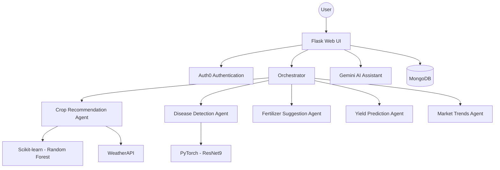

# Architecture

> Auto-generated by /map on 2026-03-20

## Overview

Krishi Mitr is an AI-driven agricultural platform designed to assist Indian farmers with precision farming advice. It utilizes a modular agent-based architecture to handle diverse tasks like crop recommendation, disease detection, and market analysis.

## Components

### Orchestrator
- **Purpose:** Central dispatcher that routes user requests to specialized agricultural agents.
- **Location:** `app/orchestrator.py`
- **Logic:** Decouples the web layer from business logic, allowing for easy expansion of agent capabilities.

### AI Assistant
- **Purpose:** Real-time chat interface for general agricultural queries.
- **Integration:** Powered by Google Gemini 1.5 Flash.
- **Location:** `app/app.py` (api_assistant route)

### Disease Detection
- **Purpose:** Classifies plant diseases from uploaded leaf images.
- **Model:** Custom ResNet9 architecture implemented in PyTorch.
- **Location:** `app/utils/disease.py`, `app/utils/model.py`

### Crop & Fertilizer Advisor
- **Purpose:** Recommends optimal crops and fertilizer application based on soil NPK and weather.
- **Models:** Random Forest classifier and rule-based logic.
- **Location:** `app/utils/fertilizer.py`, `app/utils/yield_logic.py`

## Data Flow

1. **Input:** User submits soil data or uploads an image via the Flask UI.
2. **Auth:** Request is validated via Auth0 `requires_auth` decorator.
3. **Dispatch:** the `Orchestrator` receives the request and dispatches it to the relevant agent.
4. **Processing:** The agent fetches external data (e.g., WeatherAPI) or runs an ML model (PyTorch/Sklearn).
5. **Persistence:** The result and activity are logged to MongoDB.
6. **Output:** The result is rendered in a dedicated result template (e.g., `crop-result.html`).

## Technical Debt

- [ ] **Lazy Loading:** Models are currently lazy-loaded in `app.py`, which may cause latency on the first request after restart.
- [ ] **Error Handling:** Some agents have basic try-except blocks; needs more granular error reporting.
- [ ] **Syncing:** User syncing to MongoDB is done linearly during callback; could be offloaded to a background task.

## Conventions

**Naming:** PascalCase for Classes, snake_case for functions and variables.
**Structure:** Modular `utils` directory for specific agricultural domains.
**Testing:** Basic `test/` directory exists but requires more comprehensive coverage for agents.
