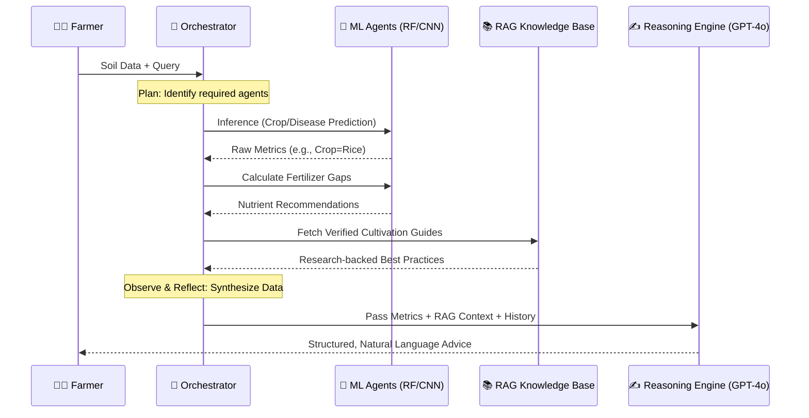

# Krishi Mitr: AI-Powered Smart Farming Ecosystem 🌾🤖

<div align="center">
  
  
  
  
  
</div>

---

## 🌟 Overview
**Krishi Mitr** (The Farmer's Friend) is a state-of-the-art **Agentic AI** ecosystem designed to bridge the gap between advanced agricultural science and grassroots farming. By leveraging a multi-agent orchestration layer and **Retrieval-Augmented Generation (RAG)**, Krishi Mitr provides highly personalized, reasoned, and data-backed strategies for precision agriculture.

---

## 🚀 The Agentic Squad (Specialized AI Agents)

Our system is powered by a team of specialized AI agents, each an expert in its domain.

| 🧙‍♂️ Agent | 🎯 Primary Goal | 🧠 Model Intelligence |
| :--- | :--- | :--- |
| **Crop Advisor** | Recommend optimal crops based on soil & climate. | **Random Forest (99.09% Acc)** |
| **Plant Pathologist** | Diagnose 38 leaf diseases from a single photo. | **ResNet9 CNN (99.21% Acc)** |
| **Nutrient Lab** | Analyze deficiencies and suggest fertilizer plans. | **Expert Rule Engine + CSV Logic** |
| **Precision Yield** | Forecast expected harvest output per hectare. | **XGBoost / RF Regressor** |
| **Sustain Master** | Plan crop rotation & long-term soil health. | **Sustainability Scoring Engine** |
| **Agri-Bot (RAG)** | Answer complex queries via verified research. | **OpenAI GPT-4o + ChromaDB** |

---

## 🔄 Intelligent Workflow (P.A.O.R Loop)

Krishi Mitr utilizes the **Plan-Act-Observe-Reflect** loop to ensure every piece of advice is contextually accurate.



---

## 📚 RAG Architecture (Retrieval-Augmented Generation)

To eliminate "AI Hallucinations," our **Agri-Bot** utilizes a high-fidelity RAG pipeline:
1.  **Ingestion**: 100+ verified research papers and government guidelines.
2.  **Vectorization**: Processed via `text-embedding-3-small`.
3.  **Storage**: Persistent vector search via **ChromaDB**.
4.  **Retrieval**: Finds the top 3 most relevant context chunks for every query.
5.  **Synthesis**: The LLM uses these chunks as a "Ground Truth" to generate advice.

---

## 🎨 UI/UX Showcase (Glassmorphism Design)

Krishi Mitr features a **Premium Glassmorphism UI** designed for clarity and ease of use.
- **Dynamic Dashboards**: Real-time visualization of soil health and model confidence.
- **Mobile First**: Fully responsive design for field use.
- **Interactive Reports**: Downloadable PDF reports with AI-generated insights.

*(Screenshots can be added here in the `app/static/images/` directory)*

---

## 📂 Project Structure

```text
Krishi-Mitr/
├── app/                 # Core Flask Application
│   ├── agents/          # Multi-agent logic (Crop, Disease, etc.)
│   ├── static/          # Premium CSS (Glassmorphism) & JS
│   ├── templates/       # HTML Templates
│   ├── utils/           # Database & Inference helpers
│   └── app.py           # Main Entry Point
├── docs/                # Technical Design & Workflow Docs
├── models/              # Pre-trained ML/DL Model Artifacts
├── notebooks/           # Training & Evaluation Notebooks
├── scripts/             # Audit & Verification Scripts
└── README.md            # You are here
```

---

## 💻 Installation & Quick Start

1.  **Clone the Repository**:
    ```bash
    git clone https://github.com/varnit/Krishi-Mitr.git
    cd Krishi-Mitr
    ```

2.  **Environment Setup**:
    ```bash
    python -m venv .venv
    .\.venv\Scripts\Activate.ps1  # Windows
    pip install -r requirements.txt
    ```

3.  **API Keys**:
    Create a `.env` file:
    ```env
    OPENAI_API_KEY=your_openai_key
    WEATHER_API_KEY=your_openweathermap_key
    GEMINI_API_KEY=your_gemini_key
    ```

4.  **Launch**:
    ```bash
    python app/app.py
    ```

---

## 🗺️ Future Roadmap

- [ ] **Multilingual Support**: Integration of Bhashini API for regional Indian languages.
- [ ] **IoT Integration**: Live telemetry from soil moisture and NPK sensors.
- [ ] **Marketplace**: Direct link to seed and fertilizer vendors based on AI advice.
- [ ] **Offline Mode**: Lite models for areas with low connectivity.

---

## 🛡️ License & Contribution

- **License**: This project is licensed under the [GNU General Public License v3.0](LICENSE).
- **Contributing**: Please see [Contributing.md](Contributing.md) for details on our code of conduct.

---

<div align="center">
  <b>Built with ❤️ for the Indian Farmer</b>
</div>
