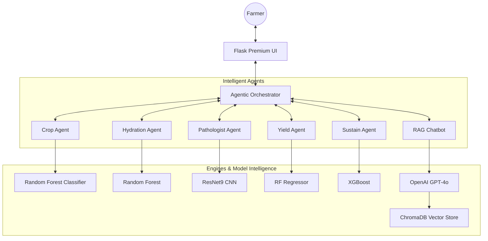
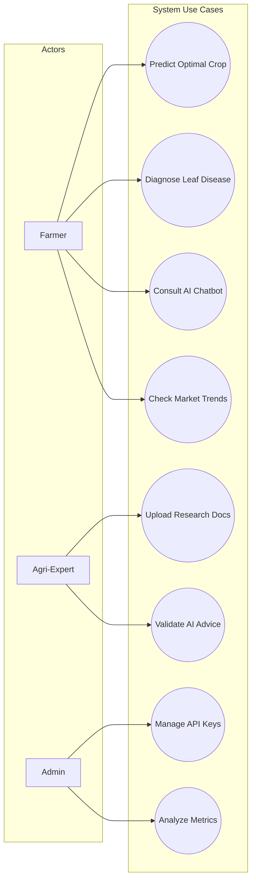
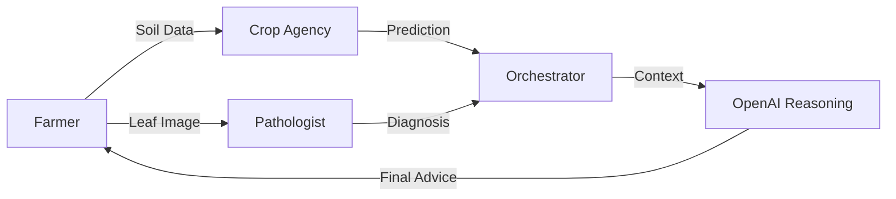
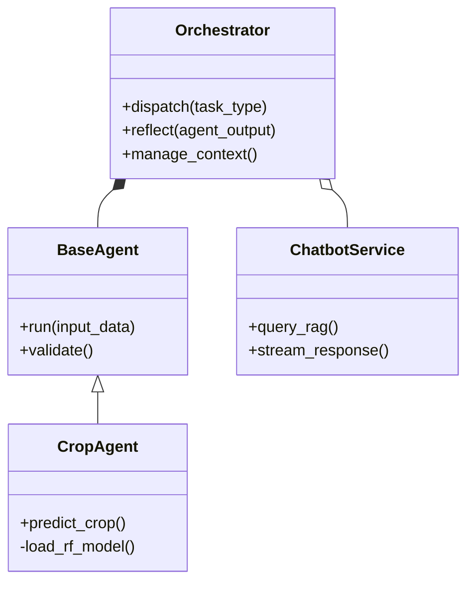

# Detailed System Design & Architecture: Krishi Mitr 🌾

## 1. System Overview
**Krishi Mitr** is an Agentic AI ecosystem designed to bridge the digital divide in agriculture. Unlike traditional static platforms, it utilizes a multi-agent orchestration layer to provide reasoned, context-aware advice for crop selection, disease management, and yield optimization.

---

## 2. System Architecture
The system follows a **Decoupled Agentic Pattern**. A central `Orchestrator` acts as the brain, dispatching tasks to specialized "limbs" (agents) and reflecting on their outputs using a Large Language Model (LLM).

---

## 3. System Requirements

### Hardware Requirements
- **Server**: 4GB+ RAM, 2 vCPUs (recommended for model hosting).
- **Client**: Any device with a web browser and camera access for leaf disease scanning.

### Software Requirements
- **Backend**: Python 3.10+, Flask 3.0.x.
- **AI/ML**: Scikit-Learn, PyTorch, LangChain, OpenAI API.
- **Database**: ChromaDB (Vector Store), CSV/Pickle (Persistent Models).

---

## 4. Use Case Analysis
The system addresses three primary actors:
- **Farmer**: Seeks crop, fertilizer, and disease advice.
- **Agri-Expert**: Enriches the RAG knowledge base.
- **Admin**: Monitors system health and API performance.

---

## 5. Data Flow Diagram (DFD Level 1)

---

## 6. Project Structure

| Directory | Purpose |
| :--- | :--- |
| `app/` | Core Flask application logic and routes. |
| `app/agents/` | Implementation of specialized AI agents. |
| `models/` | Serialized machine learning models (`.pkl`, `.pth`). |
| `notebooks/` | R&D notebooks for model training and EDA. |
| `static/` | UI assets (Lottie, CSS, JS). |
| `chroma_db/` | Vectorized knowledge base for RAG functionality. |

---

## 7. Class Structure (High-Level)

