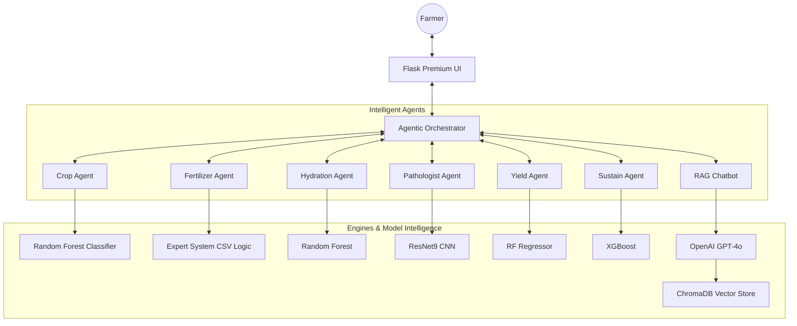
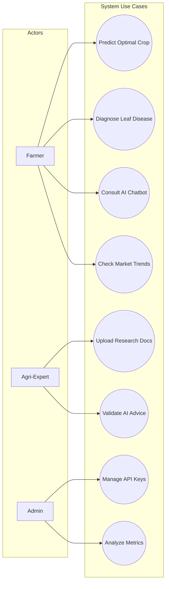
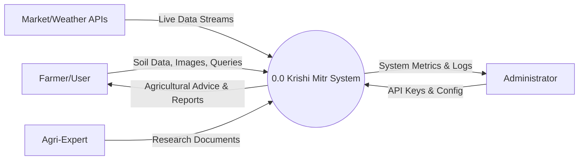
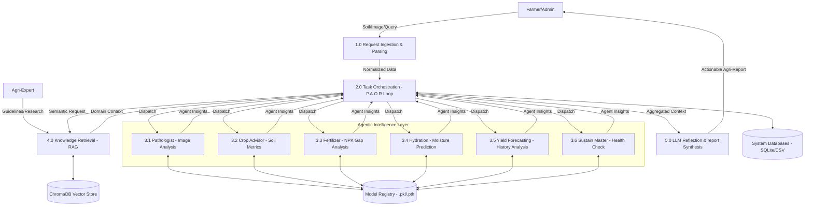
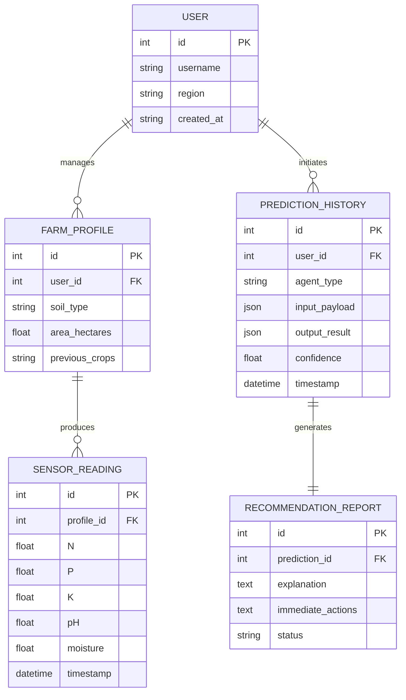
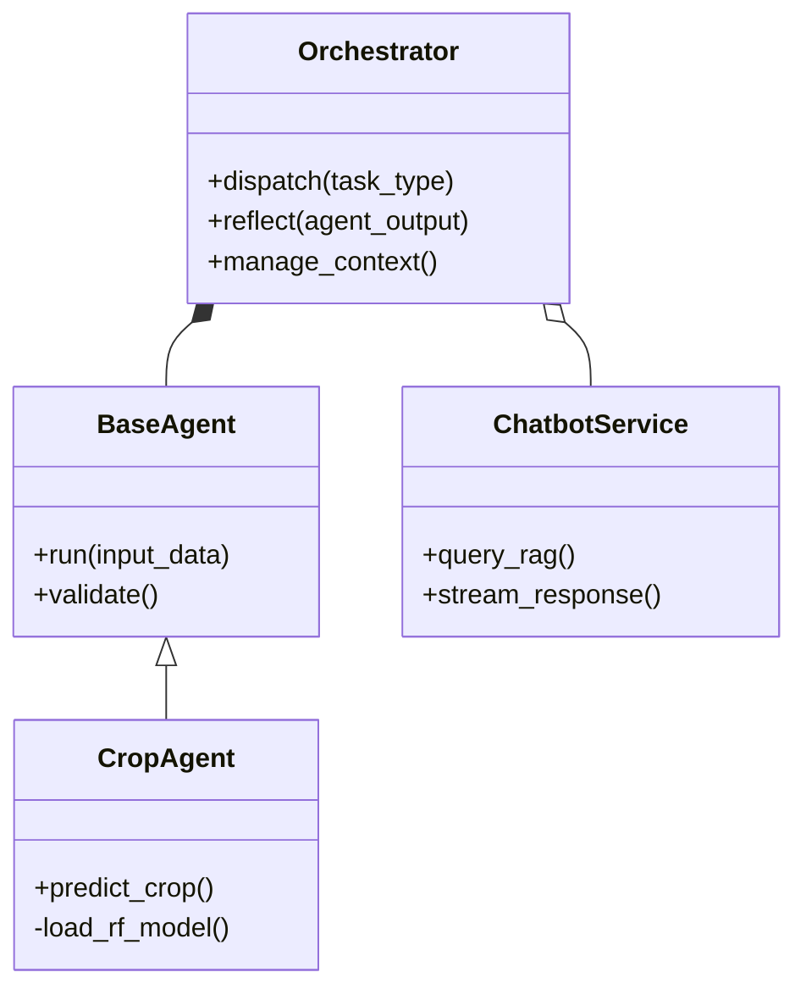

# Detailed System Design & Architecture: Krishi Mitr 🌾

## 1. System Overview
**Krishi Mitr** is an Agentic AI ecosystem designed to bridge the digital divide in agriculture. Unlike traditional static platforms, it utilizes a multi-agent orchestration layer to provide reasoned, context-aware advice for crop selection, disease management, and yield optimization.

---

## 2. System Architecture
The system follows a **Decoupled Agentic Pattern**. A central `Orchestrator` acts as the brain, dispatching tasks to specialized "limbs" (agents) and reflecting on their outputs using a Large Language Model (LLM).

---

## 3. System Requirements

### Hardware Requirements
- **Server**: 4GB+ RAM, 2 vCPUs (recommended for model hosting).
- **Client**: Any device with a web browser and camera access for leaf disease scanning.

### Software Requirements
- **Backend**: Python 3.10+, Flask 3.0.x.
- **AI/ML**: Scikit-Learn, PyTorch, LangChain, OpenAI API.
- **Database**: ChromaDB (Vector Store), CSV/Pickle (Persistent Models).

---

## 4. Use Case Analysis
The system addresses three primary actors:
- **Farmer**: Seeks crop, fertilizer, and disease advice.
- **Agri-Expert**: Enriches the RAG knowledge base.
- **Admin**: Monitors system health and API performance.

---

## 5. Data Flow Diagrams (DFD)

### 5.1 DFD Level 0: Context Diagram
The Level 0 diagram shows the system as a single process and its interaction with external entities (Farmers, Admins, and External APIs).

### 5.2 DFD Level 1: Functional Decomposition of Krishi Mitr
The Level 1 diagram breaks down the system into its operational components, showing how data flows through the specialized **Agentic Intelligence Layer**.

#### Detailed Process Descriptions (For Teacher Discussion):
- **1.0 Request Ingestion**: Captures multi-modal inputs (GPS, Soil NPK, Leaf Images). It performs data validation before passing it to the brain.
- **2.0 Orchestrator (P.A.O.R)**: This is the central controller. It **Plans** which agents to call, **Acts** by dispatching tasks, **Observes** the results, and **Reflects** using an LLM to ensure accuracy.
- **3.x Agent Sub-processes**: These are the engine rooms. They load specific ML models from `D2: Model Registry` to perform inference. This separation allows the system to scale—adding a new "Market Agent" simply requires adding another sub-process here.
- **4.0 RAG Retrieval**: This process connects the system to the real world. It pulls information from authorized research papers (stored as vectors) to ground the AI's advice in science.
- **5.0 Output Synthesis**: The final stage where complex mathematical predictions are translated into human-readable, multilingual agricultural advice.

---

## 6. Entity Relationship Diagram (ERD)
The logical data model illustrates how user profiles, field sensor telemetry, and AI-driven predictions are interconnected within the **Krishi Mitr** ecosystem.

---

## 7. Project Structure

| Directory | Purpose |
| :--- | :--- |
| `app/` | Core Flask application logic and routes. |
| `app/agents/` | Implementation of specialized AI agents. |
| `models/` | Serialized machine learning models (`.pkl`, `.pth`). |
| `notebooks/` | R&D notebooks for model training and EDA. |
| `static/` | UI assets (Lottie, CSS, JS). |
| `chroma_db/` | Vectorized knowledge base for RAG functionality. |

---

## 7. Class Structure (High-Level)

