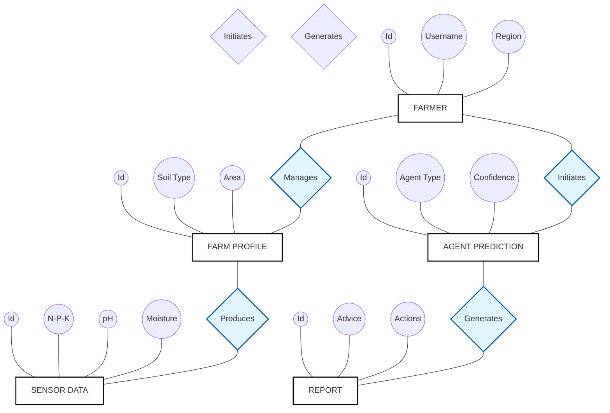

# \ud83d\udcc1 Logical ER Diagram: Krishi Mitr

This diagram represents the logical schema of the Krishi Mitr ecosystem in **Chen's Notation**, emphasizing the relationships and attributes of each entity.

### Diagram Explanation:
- **Rectangles**: Represent the major Entities (Users, Profiles, Sensors, AI Predictions).
- **Diamonds**: Represent the Relationships between these entities (e.g., A Farmer **Manages** a Farm Profile).
- **Ovals**: Represent the specific Attributes (data fields) belonging to each entity.

---
**File:** Logical_ER_Diagram.md | **Project:** Krishi Mitr
