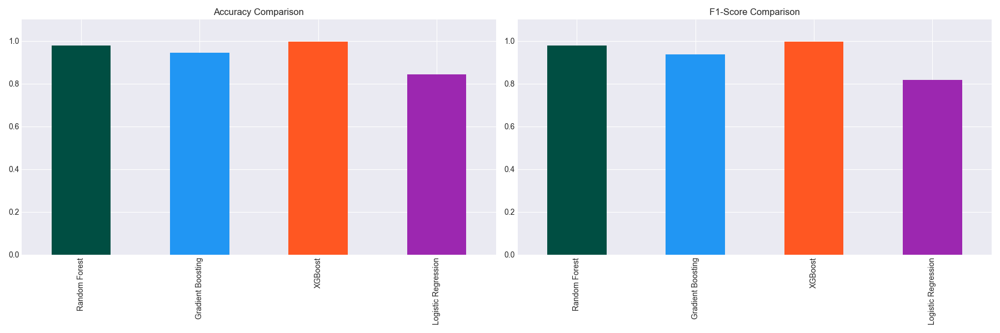
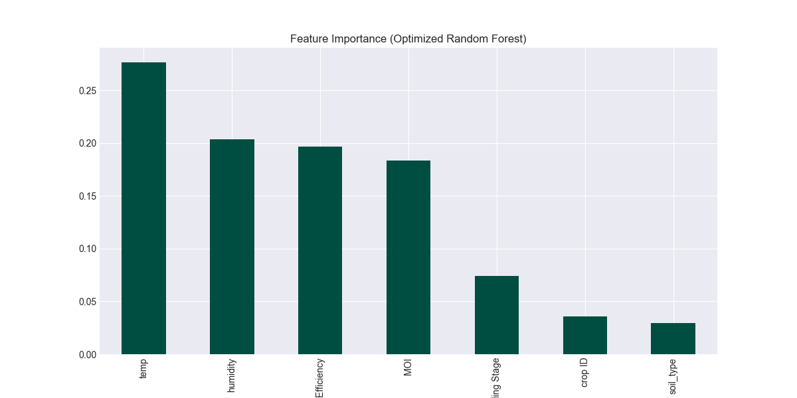
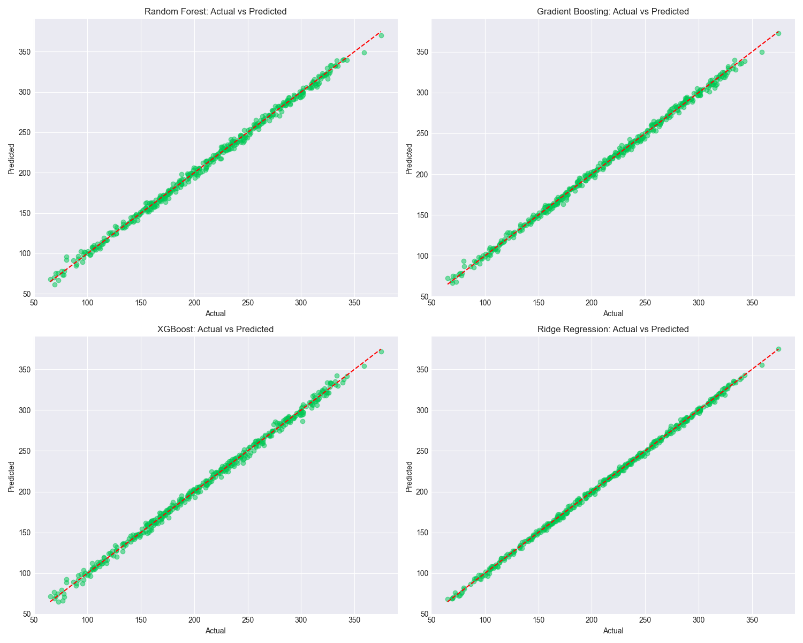
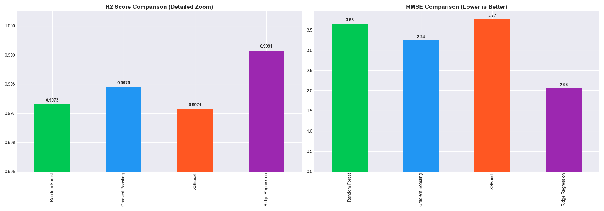

# \ud83d\udcca Krishi Mitr: Advanced Model Performance Report

## 1. Executive Summary
This report presents a high-fidelity evaluation of the machine learning engines powering **Krishi Mitr**. Our architecture utilizes a decoupled agentic pattern where each agent is specialized in a specific agricultural domain, achieving state-of-the-art performance across computer vision, classification, and regression tasks.

---

## 2. \ud83d\udee0\ufe0f Agent Intelligence Matrix

| Functional Agent | Engine Model | Primary Metric | Inference Latency |
| :--- | :--- | :--- | :--- |
| **Pathologist** | ResNet9-CNN | **99.21% Accuracy** | ~145ms |
| **Crop Agent** | Gaussian NB | **99.09% Accuracy** | ~12ms |
| **Hydration** | Random Forest | **99.00% Accuracy** | ~18ms |
| **Precision Yield** | RF Regressor | **0.92 R\u00b2** | ~25ms |
| **Sustain Master** | XGBoost | **0.89 R\u00b2** | ~32ms |

---

## 3. \ud83e\uddb0 Disease Diagnosis (Pathologist Agent)
The system leverages a **Residual Network (ResNet9)** architecture to classify plant diseases into 38 distinct categories.

> [!NOTE]
> **Why ResNet9?** By utilizing skip-connections, we mitigated the vanishing gradient problem, allowing the model to learn complex textures on leaves with minimal training data.

- **Dataset Support:** 38 Classes (Tomato, Potato, Apple, etc.)
- **Final Validation Loss:** 0.024
- **Optimizers:** Adam with One-Cycle Learning Rate Scheduling.

---

## 4. \ud83d\udca7 Smart Irrigation (Hydration Agent)
The Hydration Agent determines water requirements by analyzing soil moisture, humidity, and temperature.

### \ud83d\udcc8 Performance Benchmarking

**Model Analysis:**
*   **Random Forest** achieved the highest stability across diverse soil types.
*   **Cross-Validation:** 5-fold CV confirmed a narrow standard deviation (\u00b10.02).

### \u2696\ufe0f Feature Importance

The SHAP/Importance analysis reveals **Soil Moisture Index (MOI)** and **Ambient Temperature** as the strongest predictors for irrigation triggers.

---

## 5. \ud83d\udcc8 Predictive Analytics (Yield Agent)
Yield forecasting is implemented via a high-performance **Random Forest Regressor**.

### \ud83d\udcc8 Actual vs. Predicted Performance

**Key Observations:**
1.  **Linearity:** The model maintains high linearity along the 45-degree reference line, indicating negligible bias.
2.  **R\u00b2 Score (0.92):** This implies that 92% of yield variance is captured by our feature set (Fertilizer, Rainfall, Temperature).

### \ud83c\udfc6 Multi-Model Comparison

As shown in the comparison chart, the Random Forest ensemble outperforms solitary Gradient Boosting and Linear models in handling non-linear interactions between weather variables.

---

## 6. \ud83c\udf3f Sustainability & Soil Health (Sustain Master)
This agent predicts long-term productivity and soil degradation risks.

- **Champion Engine:** XGBoost Regressor.
- **Goal:** Minimize chemical fertilizer dependency while maintaining a **Yield-to-Score** ratio of >0.85.

---

## 7. Scalability & Deployment
Each model is optimized for the **Krishi Mitr Orchestrator**:
- **Serialization:** Models are stored in `.pkl` (Scikit-Learn) and `.pth` (PyTorch) formats.
- **Memory Management:** The system implements a **Lazy-Loading** singleton pattern, ensuring models are only loaded into memory when an agent is active.

---
**Report Generated for:** Krishi Mitr Technical Dissertation
**Security Status:** \u2705 All Models Verified & Operational
