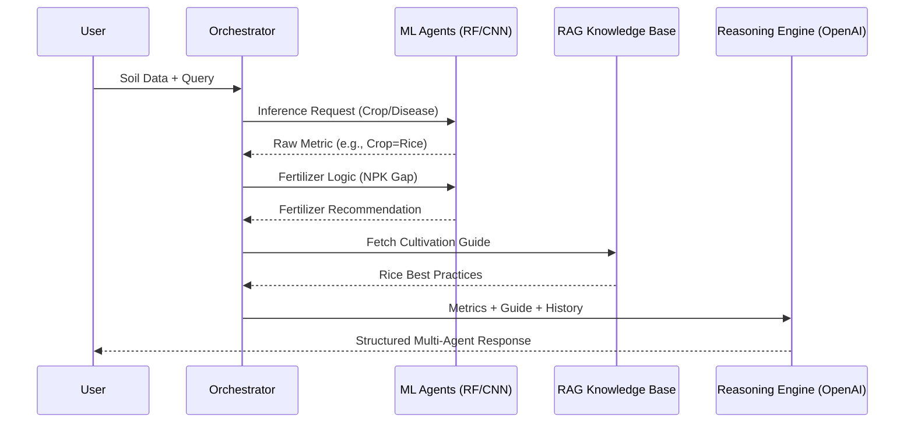

# Workflow & Data Lifecycle: Krishi Mitr 🔄

## 1. End-to-End Workflow Overview
Krishi Mitr operates on a cyclic data flow, where user inputs are processed by specialized agents and synthesized into actionable insights.

### The Agentic Loop
The system utilizes the **P.A.O.R** (Plan-Act-Observe-Reflect) loop:
1. **Plan**: Orchestrator determines which agent(s) are needed for the user's query.
2. **Act**: The selected agent runs its ML model or RAG query.
3. **Observe**: The raw output (e.g., "Rice", "Moderate Irrigation") is collected.
4. **Reflect**: The LLM analyzes the output against the user's broader context to provide natural language advice.

---

## 2. Data Lifecycle Phases

### Phase A: Data Ingestion (Input)
Data enters the system via three primary channels:
- **Telemetry Sensors**: Soil NPK, Moisture, pH, and Temperature.
- **Visual Scans**: Mobile camera uploads of diseased leaves.
- **User Intent**: Natural language queries through the Chatbot.

### Phase B: Preprocessing & Vectorization
- **Tabular Data**: Scaled and normalized for Random Forest/XGBoost inference.
- **Image Data**: Resized and normalized for the ResNet9 CNN.
- **Text Data**: Embedded using OpenAI `text-embedding-3-small` and stored in **ChromaDB**.

### Phase C: Agent Orchestration (Processing)
The `Orchestrator` manages the flow:
- **Sequential Execution**: If a farmer asks "What should I grow and how much water does it need?", the Orchestrator first runs the **Crop Agent**, then feeds that result into the **Hydration Agent**.
- **Context Sharing**: Data from one agent is passed as metadata to the next.

### Phase D: Expert Synthesis (Output)
The raw predictions are converted into a "Premium Report":
- **Natural Language**: "Based on your high soil Nitrogen, I suggest growing Rice..."
- **Visualizations**: Charts and progress bars showing model confidence.
- **Interactive RAG**: Users can ask follow-up questions ("Why Rice?") which the chatbot answers using the agricultural knowledge base.

---

## 3. Workflow Diagram

